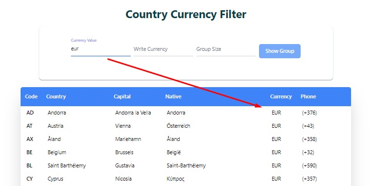
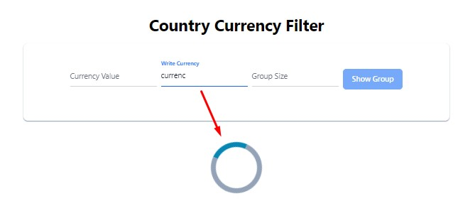
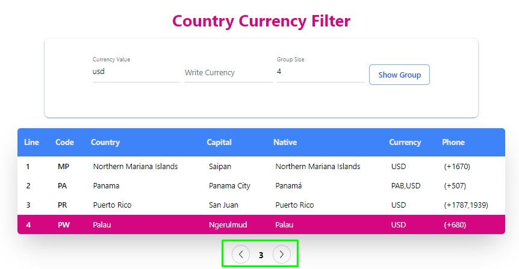

## Ülke Filtreleme - [Porjeyi Görüntüle](https://country-filter-six.vercel.app/)
 
Projeyi yaparken javascript'in React framework'unu kullandım. Proje tasarımını **Tailwindcss** kullanarak yaptım. Graphql üzerindende appolo kütüphanesini kullanarak verileri kendi localime çektim.

Bu proje girilen  para birimine göre bir filteleme ve gruplama işlemi yapıyor. 

Sayfa ilk yüklendiğinde veriler gelirken bize bir yükleme(loading) animasyonu gösteriliyor. Veriler yüklendikten sonra animasyon kalkıyor ve yüklenen veriler bize bir tabloda sunuluyor. Gelen bu tablo üzerinden filtreleme işlemleri yapabiliyoruz.

 

Filtreleme işlemleri yapmak içinde  3 farklı input alanı oluşturdum. Bu input alanına girilen verilere göre bir filtreleme işlemi yapılacak.

**1. Birinci input(Currency Value):** Bu inputa bize herhangi bir ülkenin para birimini girdiğimizde bize para birimine göre filtrelenmiş veriler gelecek. Eğer filtrelenmiş herhangi bir veri yok ise biz hata mesajı gösterilecek.

|  |  |
| ---------------------- | ---------------------- |

**2. İkinci input(Write Currency):** Bu input'a da currency yazdığımız zaman bize param birimlerine kendi içinde bir gruplama yapacak. İstenilen veriyi girerkende bize bir yükleme animasyonu gösterilecek.

|  |  |
| ---------------------- | ---------------------- |

**3. Üçüncü input(Group Size):** Bu input içine de verileri kaçlı olarak gruplamak istiyorak ona göre bir gruplama işlemi  yapacak. Örneğin **eur** para birimine göre bir filtreleme işlemi yaptığımızda ve bize 35 tane veri geldiğini varsayalım. Biz bu 35 veriyi üçerli gruplar halinde gruplamak istersek groupSize inputu içine 3 değerini girmemiz yeterli. Girilen 3 değeri sonucunda biz toplam 12 tane üçerli bir gruplama işlemi yapacak ve biz gruplar arasında ileri geri tuşları ile dolaşabileceğiz.
Listeye Dön (return list) butonuna tıkladığımzda bize bütün listeyi getirecek.

 |  |  |    |
 | ---------------------- | ---------------------- | ---------------------- |
 
 
Sayfa ilk yüklendiğinde bize 10. eleman seçilmiş olarak gelecek ve arka plan rengi diğer elemanlardan farklı olacaktır. Biz herhangi bir elemana seçtiğimizde seçtiğimiz elemanın arka plan rengi otamatik olarak değişecektir. Sadece bir tane eleman seçebiliyoruz. Birden fazla eleman seçemiyoruz.

Para birimine (Currency Value) göre filtreleme işlemi yaptığımızda filtrelenmiş olan verinin en son elemanı seçilmiş ve arka plan rengi değişmiş olarak gelecek.

### Developer
- Developer - [Musa Sayar]

### İletişim

